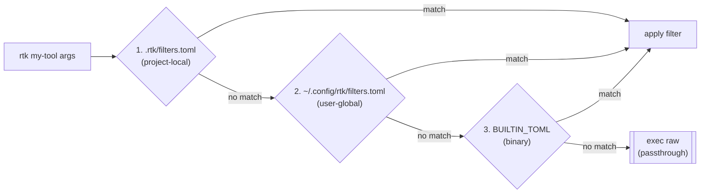

# Using Filters

RTK filters are TOML files that define how a command's output should be compressed. They are the core mechanism behind every `rtk <cmd>` savings number.

## Filter lookup priority

When you run `rtk my-tool args`, RTK checks three locations in order:

```
1. .rtk/filters.toml        (project-local)
2. ~/.config/rtk/filters.toml  (user-global)
   macOS alt: ~/Library/Application Support/rtk/filters.toml
3. BUILTIN_TOML             (embedded in binary)
```

First match wins. A project filter with the same name as a built-in shadows the built-in and triggers a warning:

```
[rtk] warning: filter 'make' is shadowing a built-in filter
```

## The 8-stage filter pipeline

Every matched filter runs output through this pipeline:

```
strip_ansi
  -> replace
    -> match_output (short-circuit: if pattern matches, emit message and stop)
      -> strip/keep_lines
        -> truncate_lines_at
          -> tail_lines
            -> max_lines
              -> on_empty (if output is empty after all stages, emit this message)
```

Stages you don't configure are skipped.

## Creating a project-local filter

Create `.rtk/filters.toml` in your project root:

```toml
[[filters]]
name = "my-tool"
match_command = "^my-tool\\b"

strip_lines = [
  "^Loading",
  "^Scanning",
]

max_lines = 50
on_empty = "my-tool: nothing to do"

[[tests.my-tool]]
input = "Loading plugins...\nScan complete: 3 issues\nWarning: foo at line 42"
expected = "Scan complete: 3 issues\nWarning: foo at line 42"
```

Verify it works:

```bash
rtk verify
```

## Filter fields reference

| Field | Type | Description |
|-------|------|-------------|
| `name` | string | Unique identifier (used in logs and `rtk verify`) |
| `match_command` | regex | Pattern matched against the full command string |
| `strip_lines` | regex[] | Remove lines matching any of these patterns |
| `keep_lines` | regex[] | Keep only lines matching any of these patterns |
| `replace` | `[[from, to]]` | String replacements applied before line filtering |
| `match_output` | regex | If matched, emit `on_match` and stop pipeline |
| `on_match` | string | Message emitted when `match_output` matches |
| `truncate_lines_at` | number | Truncate lines longer than N characters |
| `tail_lines` | number | Keep only the last N lines |
| `max_lines` | number | Keep only the first N lines after all other stages |
| `on_empty` | string | Message emitted when pipeline produces empty output |

## How built-in filters are compiled

Built-in filters live in `src/filters/*.toml` in the RTK source. At build time, `build.rs` concatenates all TOML files alphabetically and embeds the result in the binary as a constant. No external files are needed at runtime.

This means:
- Built-in filters have zero filesystem overhead
- Project filters override built-ins by name
- New built-in filters require a new RTK release

## Verifying filters

```bash
rtk verify
```

Runs every `[[tests.*]]` entry in all filter files and reports pass/fail. Use this to validate your custom filters before committing.

## Flow diagram


